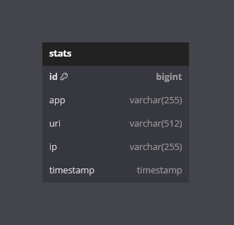
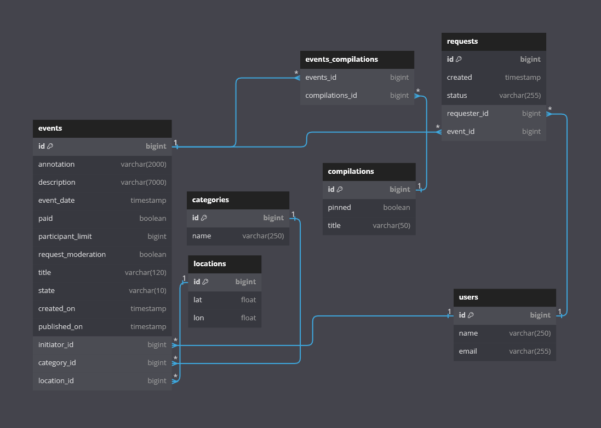
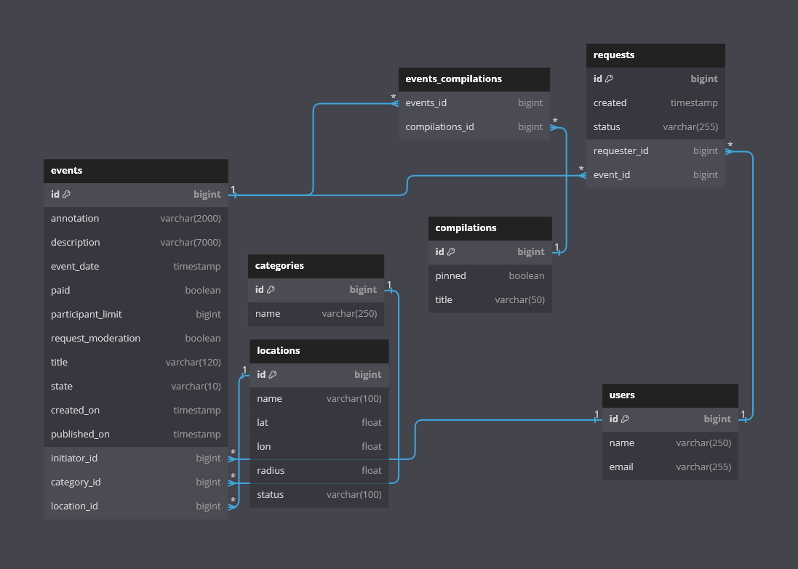

### _[Ссылка на pull request](https://github.com/MikeTheNuby/java-explore-with-me/pull/5)_

# java-explore-with-me
### _Этап 1. Сервис статистики_
### ER-диаграмма

### Описание БД
Таблица содержит данные о Uri и сервисах, для которых собирается статистика.

**Поля:**

- **id**: Это основной ключ, который генерируется автоматически. Тип данных - BIGINT.
- **app**: Это поле не может быть NULL. Оно содержит строку (VARCHAR) максимальной длины 255 символов.
- **uri**: Это поле также не может быть NULL. Оно содержит строку (VARCHAR) максимальной длины 512 символов.
- **ip**: Это поле не может быть NULL. Оно содержит строку (VARCHAR) максимальной длины 255 символов.
- **timestamp**: Это поле не может быть NULL. Оно содержит метку времени (TIMESTAMP).

#### Запрос статистики
POST /hit: Этот метод принимает входные данные в формате RequestHitInfoDto и передает их в StatisticsProcessingService для обработки. В случае успешного выполнения, он возвращает статус HTTP 201 (CREATED).

GET /stats: Этот метод возвращает статистику в формате списка StatisticsResponseData. Он принимает следующие параметры:

start: время начала периода статистики. Формат: “yyyy-MM-dd HH:mm:ss”.
end: время окончания периода статистики. Формат: “yyyy-MM-dd HH:mm:ss”.
uris (необязательный): список URI для фильтрации статистики.
unique (необязательный): флаг, указывающий, следует ли учитывать только уникальные попадания.
Все данные передаются в StatisticsProcessingService для обработки и получения результата.

### _Этап 2. Основной сервис_
### ER-диаграмма

**Поля:**

-**users**: содержит информацию о пользователях. Каждый пользователь имеет 
уникальный идентификатор (id), имя (name) и уникальный адрес электронной почты (email).

-**locations**: содержит информацию о местоположениях. Каждое местоположение имеет 
уникальный идентификатор (id), широту (lat) и долготу (lon).

-**categories**: содержит информацию о категориях. Каждая категория имеет уникальный 
идентификатор (id) и уникальное имя (name).

-**compilations**: содержит информацию о компиляциях. Каждая компиляция имеет 
уникальный идентификатор (id), статус закрепления (pinned) и заголовок (title).

-**events**: содержит информацию о событиях. Каждое событие имеет уникальный 
идентификатор (id), аннотацию (annotation), описание (description), дату проведения события (event_date), статус оплаты (paid), лимит участников (participant_limit), статус модерации запросов (request_moderation), заголовок (title), состояние (state), дату создания (created_on), дату публикации (published_on), идентификатор инициатора (initiator_id), идентификатор категории (category_id) и идентификатор местоположения (location_id).

-**events_compilations**: содержит информацию о связях между событиями и 
компиляциями. Каждая запись имеет идентификатор события (events_id) и идентификатор компиляции (compilations_id).

-**requests**: содержит информацию о запросах. Каждый запрос имеет уникальный 
идентификатор (id), дату создания (created), статус (status), идентификатор заявителя (requester_id) и идентификатор события (event_id).

### _Этап 3. Дополнительная функциональность_
### ER-диаграмма

[Ссылка на диаграмму](https://dbdiagram.io/d/64fa0aea02bd1c4a5e2a64d2)